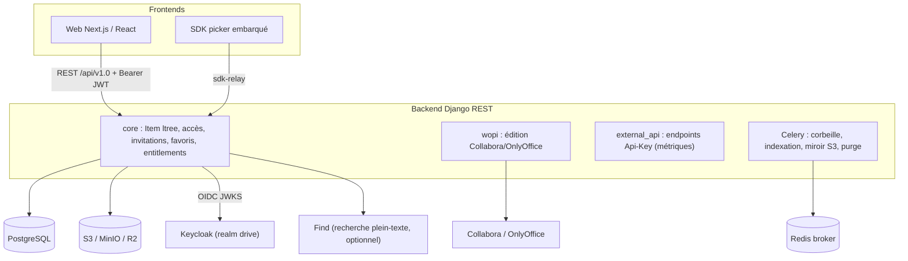
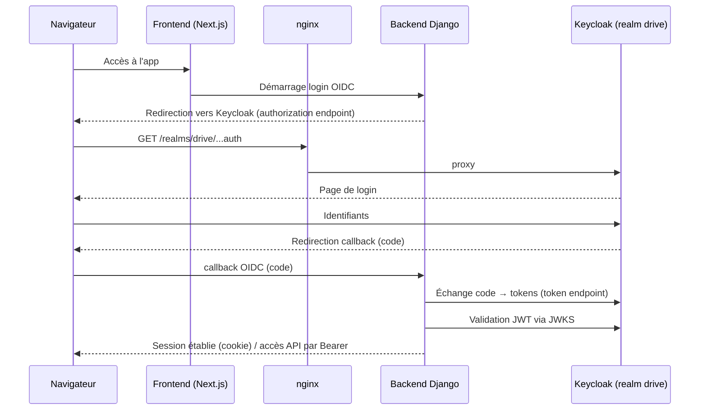
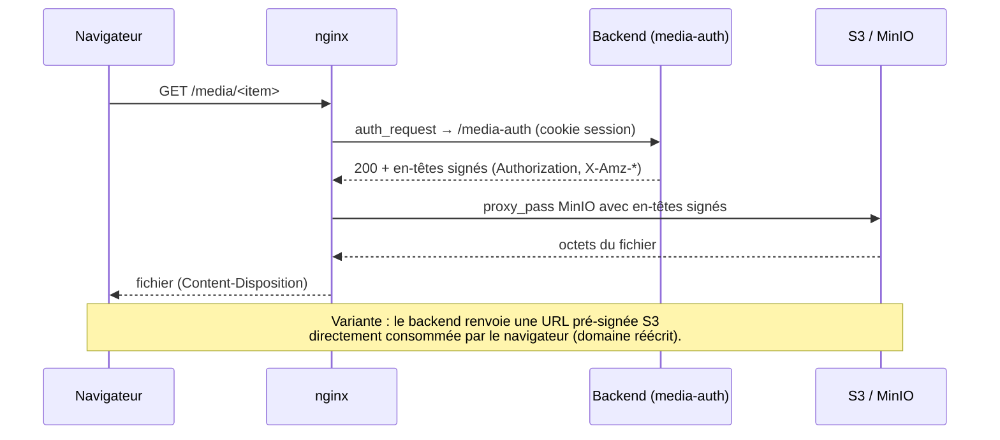

# 02 — Architecture technique

## Composants

## Pile technique

- **Backend** : Python 3.13, Django 5.2 + DRF, `django-configurations`, `django-ltree`,
  `django-lasuite` (OIDC + RBAC), Celery, `boto3`/`django-storages[s3]`, `drf-spectacular`
  (OpenAPI/Swagger), `python-magic`.
- **Frontend** : Next.js 15 (Pages Router), React 19, TanStack Query/Table, react-i18next,
  Cunningham (design system) ; organisation **par feature** (`src/features/*`).
- **Auth** : OIDC (Keycloak realm `drive`), JWT/JWKS, sessions (12 h).
- **Édition** : protocole **WOPI** (`WOPI_*_DISCOVERY_URL`).

## Flux d'authentification (OIDC)

## Flux média (lecture sécurisée)

Deux voies coexistent : **URL pré-signée S3** (réécrite pour le navigateur via
`AWS_S3_DOMAIN_REPLACE`) et **proxy nginx avec autorisation par item**.

## Flux d'édition WOPI

Frontend ouvre `/wopi/[id]` → iframe de l'éditeur (Collabora/OnlyOffice) qui dialogue
avec le backend WOPI (`WOPI_SRC_BASE_URL`) pour lire/écrire le fichier dans S3.

## Asynchrone

Les opérations lourdes (purge corbeille, indexation recherche, miroir S3, renommage de
fichier sur le stockage) sont déléguées à **Celery** (broker Redis), avec `celery beat`
pour les tâches planifiées.
