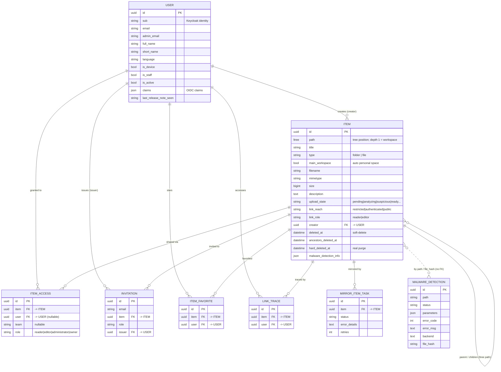

# Modèle de données — Drive

Source de vérité : `src/backend/core/models.py` (+ app `malware_detection`).

Toutes les entités héritent d'un `BaseModel` abstrait : `id` (UUID, PK), `created_at`,
`updated_at`.

L'entité centrale est **`Item`** : un **arbre unique** (matérialisé par `django-ltree`,
colonne `path`) qui représente **à la fois** les espaces, dossiers et fichiers — il n'y a
pas de table séparée par type. Un *espace* est un item racine (`path` de profondeur 1),
un *dossier*/*fichier* est un item imbriqué. Le partage et les permissions s'appliquent
au niveau de l'`Item` et s'héritent par l'arbre. L'identité (`User`) est déléguée à
Keycloak (champ `sub`).

## Diagramme (ERD)

## Entités

### `User` — comptes (identité déléguée à Keycloak)
`sub` (identité Keycloak), `email`/`admin_email`, `full_name`/`short_name`, `language`,
`is_device`, `is_staff` (→ accès admin Django), `is_active`, `claims` (JSON),
`last_release_note_seen`.

> `main_workspace` (vu côté frontend) n'est **pas une colonne** : c'est dérivé — l'`Item`
> racine de l'utilisateur avec `main_workspace=True`.

### `Item` — espaces / dossiers / fichiers (arbre ltree)
Voir les champs dans le diagramme. Points clés :
- `path` (ltree) porte la hiérarchie complète ; **profondeur 1 = espace** (racine).
- `type` ∈ {`folder`, `file`} ; `main_workspace=True` = espace personnel auto-créé.
- `link_reach`/`link_role` = partage par lien ; `creator` = propriétaire initial.
- Soft-delete via `deleted_at` + `ancestors_deleted_at` (corbeille avec rétention),
  purge réelle via `hard_deleted_at`.

### `ItemAccess` — partage avec rôles
`item`, `user` (nullable), `team` (nullable), `role` ∈ {reader, editor, administrator, owner}.
**Contraintes** : soit `user`, soit `team` (jamais les deux) ; unicité `(user,item)` et
`(team,item)`.

### `Invitation` — invitations en attente (par e-mail)
`email`, `item`, `role`, `issuer` (→ User). Pour partager avec un utilisateur pas encore inscrit.

### `ItemFavorite` — favoris (★)
`item`, `user`.

### `LinkTrace` — traçage d'accès par lien
`item`, `user`. Enregistre l'accès via lien (alimente « Partagés avec moi »).

### `MirrorItemTask` — tâches de miroir S3
`item`, `status`, `error_details`, `retries`. Suivi du mirroring du stockage (cf.
`docs/s3_mirroring.md`).

### `MalwareDetection` — résultats d'analyse antivirus (app séparée)
`path`, `status`, `parameters` (JSON), `error_code`, `error_msg`, `backend`, `file_hash`.
Reliée aux items par `path`/`file_hash`, **sans FK directe**.

## Énumérations clés
- **ItemType** : `folder`, `file`
- **Role** (ItemAccess / Invitation) : `reader` → `editor` → `administrator` → `owner`
- **LinkReach** : `restricted`, `authenticated`, `public`
- **LinkRole** : `reader`, `editor`
- **UploadState** : `pending`, `duplicating`, `analyzing`, `suspicious`,
  `file_too_large_to_analyze`, `ready`…
