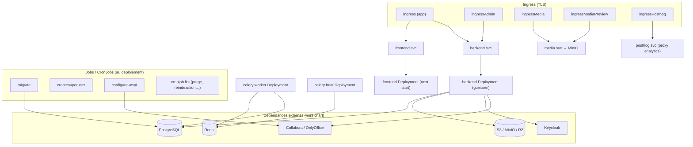

# 04 — Architecture infrastructure

## Conteneurs (développement — `compose.yaml`)

`postgresql`, `redis`, `minio` (+`createbuckets`), `mailcatcher`, `keycloak`
(+`kc_postgresql`), `app-dev` (Django), `celery-dev`, `nginx`, `frontend-dev`,
`collabora`, `onlyoffice`, `ds-proxy` (chiffrement S3, désactivé par défaut),
`crowdin`, `node`.

> ⚠️ **Adaptations locales Windows** (cette instance) : ports remappés (redis 6381,
> minio 9100, keycloak 8180, nginx/auth 8183), base PostgreSQL sur **volume nommé**
> (et non bind-mount Windows, qui provoque des crash-loops fsync), entrypoint backend
> converti en **LF** (CRLF casse le shebang en conteneur Linux).

## Déploiement Kubernetes (Helm — `src/helm/drive`)

### Ressources du chart
- **Deployments** : `backend`, `frontend`, `celery worker`, `celery beat`.
- **Jobs** : `migrate`, `createsuperuser`, `configure-wopi` ; **CronJobs** (`backend_cronjob_list`).
- **Services + Ingress** : app, **admin**, **media**, **media-preview**, **posthog**
  (TLS activable par ingress ; média routé vers MinIO via `upstream-vhost`).
- **Multi-env** : `helmfile.yaml.gotmpl` + `env.d/<env>/values.*.gotmpl`.
- **Dépendances externes attendues** (non packagées) : PostgreSQL, Redis, S3, Keycloak,
  serveurs WOPI.

## Stockage & réseau

- **Objets** : S3-compatible (MinIO dev, R2/S3 prod), **versioning bucket activé**, URLs
  pré-signées, option **chiffrement at-rest** via **ds-proxy** (proxy S3 chiffrant —
  cf. [`../ds_proxy.md`](../ds_proxy.md)).
- **Statique** : WhiteNoise / `collectstatic`, `STORAGES` configurable.
- **Réseau** : nginx en frontal (autorisation média + proxy Keycloak), réseau Docker
  `lasuite`.

## Caractéristiques de scalabilité
- Backend & frontend **stateless** → scale horizontal.
- Celery scalable par nombre de workers.
- État externalisé : PostgreSQL / S3 / Redis dimensionnés hors cluster.
