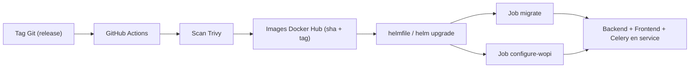

# 06 — Déploiement & CI/CD

## Pipelines GitHub Actions (`.github/workflows`)

| Workflow | Rôle |
|---|---|
| `docker-hub.yml` | Build **multi-arch** (amd64/arm64) des images `lasuite/drive-backend` & `drive-frontend`, **scan Trivy**, push sur tags |
| `drive-frontend.yml` | Lint / tests / build frontend |
| `build-mails.yml` | Génération des templates e-mail (MJML → HTML) |
| `crowdin_upload.yml` / `crowdin_download.yml` | Synchronisation des traductions (Crowdin) |

## Images

- **Backend** : cible Docker `backend-production` (Gunicorn, `drive.wsgi`).
- **Frontend** : `next start`.
- Build multi-architecture, scannées **Trivy** (vulnérabilités) avant push.

## Chaîne de promotion

Au déploiement Helm, les **Jobs de migration** et de configuration WOPI tournent avant
la mise en service.
