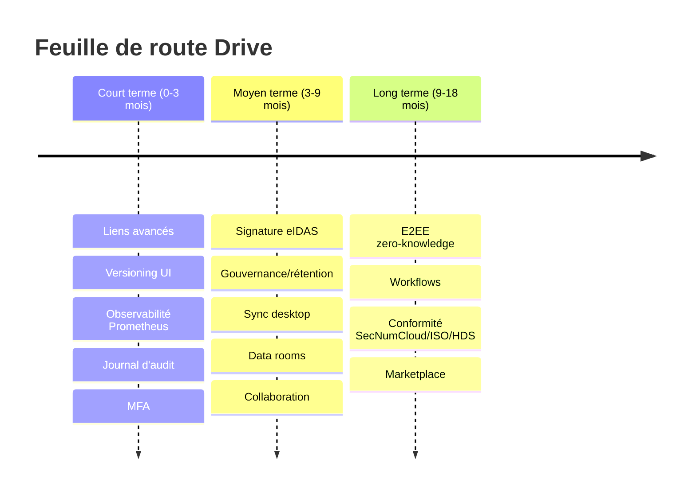

# 11 — Feuille de route

Priorisation par **valeur / effort**, alignée sur les écarts de l'
[analyse concurrentielle](./10-competitive-analysis.md).

## Court terme (0–3 mois) — parité « partage pro » & observabilité
1. **Liens avancés** : mot de passe, date d'expiration, limite de téléchargements,
   révocation. *(extension des liens/`ItemAccess` existants — effort modéré)*
   → comble l'écart vs **tous** les concurrents.
2. **Historique de versions (UI)** : exploiter le versioning S3 (déjà activé) +
   endpoints de listing/restauration/téléchargement de version. *(moyen)*
3. **Observabilité technique** : export **Prometheus** (latence, taux d'erreur, files
   Celery), dashboards Grafana, alerting. *(faible/moyen)*
4. **Journal d'audit** : généraliser `LinkTrace` en *activity log* (qui / quoi / quand)
   + export. *(moyen)* → vs Box/ShareFile/Oodrive.
5. **MFA & politiques** : forcer MFA, durée de session, politiques mot de passe via
   Keycloak. *(faible — configuration)*

## Moyen terme (3–9 mois) — briques entreprise
6. **Signature électronique (eIDAS)** : intégration ou connecteur souverain
   (cf. Oodrive Sign / Tresorit eSign / Box Sign). **Fort différenciateur marché FR**. *(élevé)*
7. **Gouvernance & rétention** : politiques de rétention par espace, **legal hold**,
   classification/labels, amorce de **DLP**. *(élevé)* → vs Box Governance / Oodrive Save.
8. **Client de synchronisation desktop** (+ apps mobiles natives). *(élevé)* → vs tous.
9. **Data rooms / partage externe sécurisé** : espaces invités, *watermarking*,
   permissions « view-only / no-download ». *(moyen/élevé)* → vs ShareFile VDR / Oodrive.
10. **Collaboration** : commentaires/annotations, mentions, notifications. *(moyen)*

## Long terme (9–18 mois) — différenciation
11. **Chiffrement E2EE « zero-knowledge »** optionnel par espace sensible (gestion de
    clés côté client, généralisation de ds-proxy). **Seul Tresorit le propose** —
    fort positionnement souverain. *(très élevé, R&D)*
12. **Workflows / automatisation** (règles, approbations) façon Box Relay / ShareFile.
13. **Conformité** : trajectoire **SecNumCloud / ISO 27001 / HDS** (santé, comme
    Oodrive) pour adresser secteur public et secteurs régulés. *(organisationnel + technique)*
14. **Marketplace d'intégrations** / connecteurs (DMS, ERP, e-parapheur).

## Atouts à capitaliser (produit / marketing)
- **Souveraineté + open-source + auto-hébergement** (vs Box/ShareFile US ; avantage de
  contrôle vs Oodrive/Tresorit propriétaires).
- **Édition Office intégrée** (Collabora/OnlyOffice) sans licence propriétaire.
- **SDK picker embarquable** → intégration dans les autres applications de la suite.
- **Multilingue + RTL (arabe)** → marchés francophones **et** arabophones.

## Synthèse visuelle

